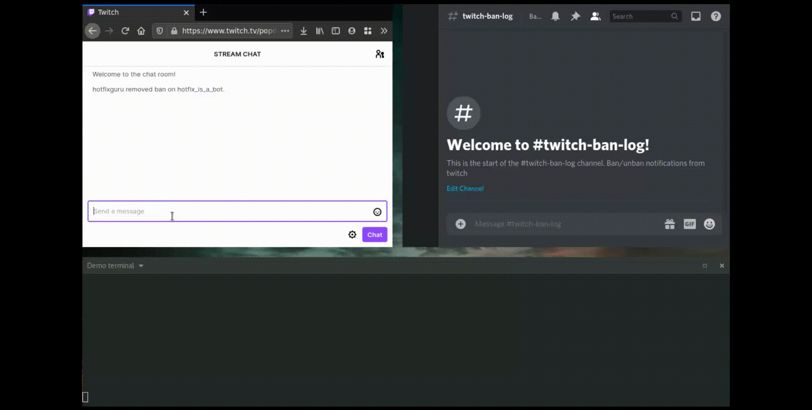

# discord-pubsub
A client that makes it easier to have transparency of what happens in a twitch chat by 
posting ban, unban and appeal logs to Discord - live.

 - Open connection to the Twitch PubSub WebSocket
 - Handles reconnect signals and required ping
 - Subscribes to mod event topics with a generated auth token. Fetched and refreshed automatically.
 - Post `ban`, `unban`, `DENY_UNBAN_REQUEST` and `APPROVE_UNBAN_REQUEST` via Webhooks to Discord rooms.

This is a very simple project written in an evening so it may contain some bugs. 

# Example


# Hosting and deployment
Hosted on a gcloud f1 free micro tier instance. 

1. Create a `.env` based on `.env.example`. You can get the auth code by using the `code` flow:
`https://id.twitch.tv/oauth2/authorize?client_id=<clientID>&redirect_uri=<redirect_url>&response_type=code&scope=channel:moderate`

2. Build image locally with `Docker` or `Podman`
```bash
# Build image
podman build -f Dockerfile . --tag dp:0.1 --tag gcr.io/<project>/dp:0.1
# Run locally
podman run -t localhost/dp:0.1
```

3. Push image to google cloud
```bash
podman push gcr.io/<project>/dp:0.1
```
